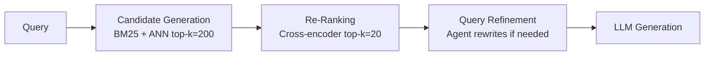
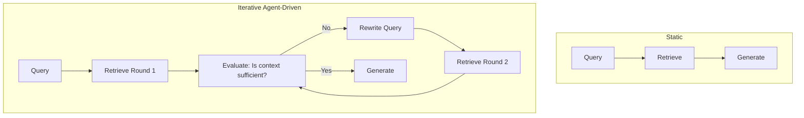
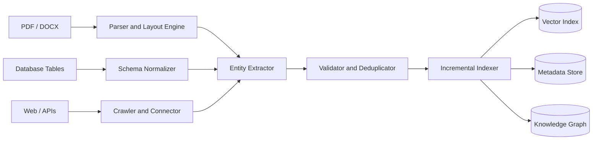
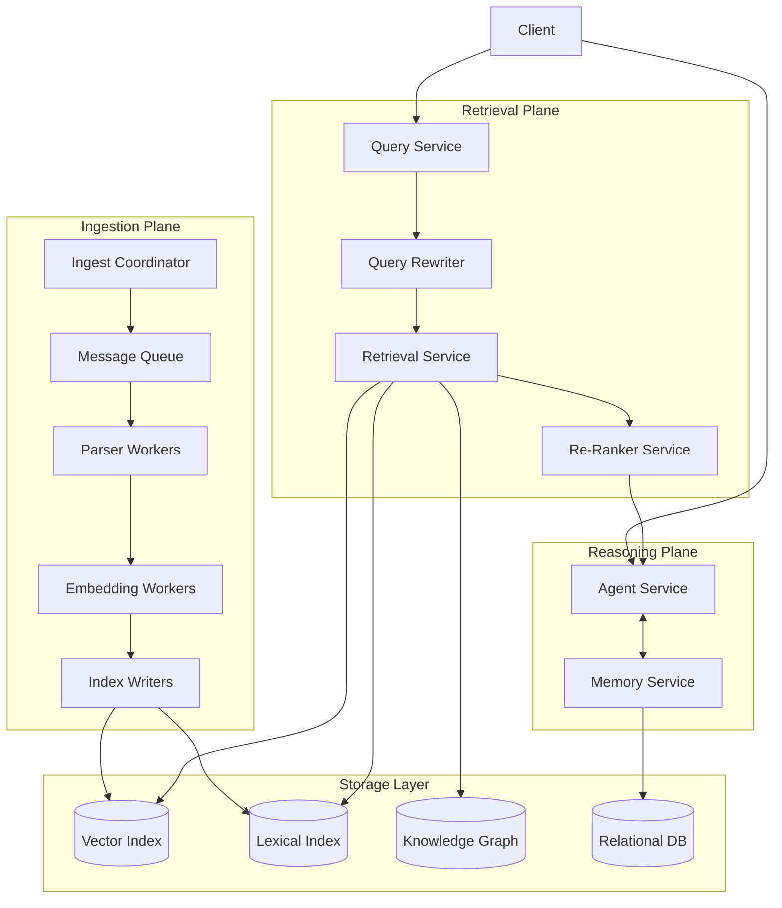

# Architectural Analysis of RAGFlow

---

## 1. Deep Document Understanding vs. Naive Chunking

Fixed-size chunking treats a document as a flat stream of tokens and splits every N characters without regard for meaning or structure. This is fast and simple, but it fails at exactly the wrong moments. A 512-token window might split a financial table mid-row, separate a chart from its caption, or merge an executive summary with unrelated body text. The result is chunks that are syntactically complete but semantically broken — they contain words but not meaning.

RAGFlow's DeepDoc engine takes a different approach. Before any chunking occurs, it performs layout detection, reading-order correction, and structure extraction. It understands that a document has logical units — paragraphs, table cells, section headers, figure captions — and it chunks along those boundaries instead of arbitrary token counts.

The impact on retrieval fidelity is significant. When a user asks "What was Q3 gross margin?", the answer may live inside a nested table cell. A fixed-size chunker either drops the table entirely or produces a chunk like `| 38.2% | 41.1% | 39.7% |` with no row or column context, making it nearly impossible to retrieve and interpret correctly. A layout-aware parser reconstructs the table as a structured object and emits a self-contained, interpretable chunk like "Q3 gross margin: 38.2% (FY2024, Segment A)." The retrieval signal is dramatically stronger.

For index design, deep parsing enables richer schemas. Instead of indexing raw text alone, the system can index typed fields — field type, row header, column header, value, page number — which opens the door to hybrid structured-semantic search. Naive chunking collapses all of this into a single unstructured text field, throwing away information that was present in the original document.

The honest trade-off is preprocessing cost. Layout detection using vision models like PaddleOCR or LayoutLM adds latency and compute expense per document — potentially an order of magnitude more than whitespace splitting. For high-volume, low-stakes corpora like plain-text news articles, this overhead is hard to justify. The right design is to parameterize the parsing depth: use lightweight chunking for homogeneous plain-text inputs and invest in deep parsing only when documents contain tables, figures, or complex layouts. RAGFlow's configurable PDF parsers reflect exactly this reasoning.

---

## 2. Chunking Strategy: Template vs. Semantic

Template-based chunking uses document structure as split boundaries. It might split on heading markers, detect known regulatory section labels like "Item 1A. Risk Factors," or apply domain-specific rules to a well-formed schema. The key property is that it is deterministic, fast, and requires no embedding computation. Given a financial report, a template chunker can reliably isolate the income statement, the risk factors section, and the management discussion independently of their content.

Embedding-driven semantic segmentation takes a different approach. It encodes sentences incrementally and splits when the cosine similarity between adjacent embeddings drops below a threshold, which signals a topic shift. It adapts to content rather than structure, which makes it flexible for corpora where formatting is inconsistent or absent.

Each strategy has a clear failure mode depending on the type of document. For highly structured documents like financial reports, semantic chunking is the weaker choice. The semantic similarity between "Revenue Recognition Policy" and "Revenue: $4.2B" is high because both discuss revenue, so the model may merge them into one chunk. But these are functionally distinct sections — one is an accounting policy, the other is a reported figure — and retrieval benefits from keeping them separate. The template chunker correctly identifies the section boundary from document structure; the semantic chunker may not.

For loosely structured corpora like chat logs or forum threads, the situation reverses. A template chunker finds no headings and no section delimiters, so it degrades to fixed-size splitting — exactly the naive approach we were trying to avoid. An embedding-based segmenter, by contrast, can still detect topic shifts in conversational text where a user switches from asking about pricing to asking about support. It captures topical coherence even when there is no formatting to lean on.

The practical conclusion is that neither strategy dominates universally. A well-designed system uses template chunking as the primary strategy when the document schema is known, and falls back to semantic segmentation for unstructured inputs. This is the configurable approach RAGFlow exposes, and it is the right one.

---

## 3. Hybrid Retrieval Architecture

BM25 is a lexical retrieval model that ranks documents by weighted term overlap between the query and the document. Dense vector retrieval maps both the query and each document into a shared embedding space and measures similarity by cosine or inner product. Their failure modes are orthogonal, which is the core reason hybrid retrieval works.

BM25 fails on vocabulary mismatch. If a user queries "what are the side effects of the compound that blocks ACE2 receptors," documents that use the phrase "SARS-CoV-2 entry inhibitor" will be missed entirely because none of the query tokens appear in them. The model has no concept of synonymy or semantic proximity — it only sees characters. This is the fundamental limitation of lexical-only retrieval.

Dense retrieval fails on precision for exact terms. A query like "Section 12(b) securities" has a precise legal meaning. A vector model may retrieve semantically adjacent chunks about public company disclosures that are contextually related but do not satisfy the exact statutory reference the user needs. Dense models also degrade on rare entities — product model numbers, personal names, or technical identifiers — that are underrepresented in pretraining data and therefore poorly represented in the embedding space.

Because these failures are independent, taking the union of results from both retrievers provably improves recall relative to either alone. A re-ranker — typically a cross-encoder — then scores each candidate pair of (query, document) with full attention over both, correcting the ordering that the cheaper bi-encoder retrieval produced.

The edge case worth naming is correlated failure. When both BM25 and dense retrieval agree on the wrong document — for example, a chunk that shares vocabulary and semantic similarity with the query but contains outdated information — the re-ranker has no signal to demote it. Hybrid retrieval helps when retriever failures are independent. It provides no benefit when both retrievers fail for the same reason. This is why corpus quality and freshness remain first-order concerns even in a well-designed hybrid system.

---

## 4. Multi-Stage Retrieval Pipeline

A single-pass ANN search applies one scoring function to the entire index and returns the top results. It is fast, but it uses a coarse scoring model — the bi-encoder — which encodes the query and each document independently. Because query-document token interactions are never modeled jointly, fine-grained relevance distinctions are invisible to it.

A multi-stage pipeline separates this problem into two sub-problems with different cost profiles. Candidate generation prioritizes recall: retrieve a large candidate set using fast approximate nearest neighbor search. Re-ranking then prioritizes precision: apply a cross-encoder to the small candidate set, scoring each query-document pair jointly with full attention. This achieves the precision of a cross-encoder at a fraction of the cost, because the expensive model is only applied to a small, pre-filtered set.

The recall-versus-latency trade-off lives at the boundary between these two stages. Increasing the number of candidates passed to the re-ranker improves recall — the true relevant document is more likely to be included — but increases re-ranking latency linearly. In practice, a candidate set of 100 to 200 results is a common operating point. The retrieval stage should be tuned so that the true relevant document is in the candidate set with high probability before re-ranking begins, because no downstream component can recover a document that was never retrieved in the first place.

This introduces cascading error propagation, which is the most important failure mode of multi-stage pipelines. If the relevant document is absent from the candidate set, the re-ranker can only reorder what it received. The failure propagates silently into incorrect LLM responses with no visible error signal. The mitigation is to treat recall-at-k as a primary system metric, monitor it actively, and tune the candidate generation stage to maintain high recall even at the cost of including some noise that the re-ranker will later filter out.

---

## 5. Indexing Strategy and Storage Backends

Selecting a storage backend is fundamentally a question of matching the query access pattern to the index structure that serves it most efficiently. There is no universally correct choice — the right backend depends on what kinds of questions users ask and what the documents look like.

An Elasticsearch-like hybrid store is best suited for workloads that mix keyword search with structured filtering. A query like "find contracts mentioning indemnification for clients in California signed after 2022" needs BM25 over document text and exact-match filters over metadata fields simultaneously. Elasticsearch's inverted index handles the lexical component, and its metadata filtering is applied as a post-filter or filter-first depending on selectivity. This backend also excels at scale — it is designed to handle billions of documents through horizontal sharding. The trade-off is that vector search, while supported in recent versions, is not its primary design target and tends to underperform purpose-built vector databases at high dimensionality.

A vector-native database like Qdrant, Weaviate, or RAGFlow's own Infinity engine is optimized for pure semantic retrieval. Its HNSW index provides low-latency approximate nearest neighbor search with high throughput. This is the right choice when queries are natural language, document metadata is sparse or irrelevant, and the query distribution is broad and unpredictable. The limitation is that it cannot natively answer structured queries — there is no equivalent of a SQL JOIN or a range filter over a typed schema.

A graph-augmented store is appropriate when the knowledge domain has explicit entity relationships and queries require multi-hop reasoning. A question like "which suppliers of Company X are also customers of Company Y?" cannot be answered by vector retrieval alone, because there is no single chunk that encodes that relationship. It requires traversing a graph of typed edges. The cost is high: building the graph requires entity extraction, relation classification, and coreference resolution across the entire corpus. Traversal at scale requires a dedicated graph engine. This backend is justified when relational reasoning is a first-class requirement and the domain is well-defined enough to support a coherent ontology.

---

## 6. Query Understanding and Reformulation

A raw user query is a compressed, ambiguous expression of an information need. The semantic gap between the query and the way the relevant document is phrased is one of the primary causes of retrieval failure, and query transformation is the main tool for reducing it.

Query expansion adds synonyms, acronyms, or related terms to the original query. Translating "MI" to "myocardial infarction, heart attack" before retrieval recovers documents that use clinical language the user did not. Query decomposition breaks a complex question into atomic sub-queries that can be retrieved independently and then synthesized. A question like "compare the revenue and headcount growth of Apple and Microsoft over the last five years" decomposes into four separate retrieval tasks. A technique called HyDE — Hypothetical Document Embeddings — goes further by generating a hypothetical answer to the query, embedding that answer, and using the resulting vector as the retrieval query. This bridges the distributional mismatch between short conversational queries and longer, more formal document passages.

Static query-to-retrieval is a single forward pass. The query goes in, retrieval runs once, and the LLM generates from whatever context was returned. It is fast, predictable, and appropriate when queries are well-formed and the corpus is dense enough that a single retrieval round is likely to surface the answer. The failure is silent: if retrieval misses, generation hallucinates or abstains, and there is no mechanism to recover.

Iterative, agent-driven refinement uses the LLM as a critic of its own retrieved context. After each retrieval round, the agent evaluates whether the context is sufficient to answer the question, and if not, rewrites the query and retrieves again. This is powerful for multi-hop and ambiguous questions but introduces latency across multiple retrieval rounds and creates the risk of infinite loops if the stopping condition is poorly defined. RAGFlow's multi-turn optimization implements a bounded version of this loop with configurable iteration limits, which is the right engineering constraint to apply.

---

## 7. Knowledge Representation Layer

Dense vector representations embed documents and queries into a high-dimensional space where semantic similarity corresponds to geometric proximity. Retrieval is fast — approximate nearest neighbor search scales to millions of documents with low latency. Compositional reasoning is implicit: the model encodes relationships during pretraining and expresses them through proximity in embedding space. The significant limitation is explainability. There is no human-interpretable reason why one vector is close to another. When a retrieval result is wrong, there is no trace to inspect, which makes debugging and auditing difficult in enterprise settings.

A relational schema stores knowledge in typed tables with defined columns and foreign-key relationships. Compositional reasoning is explicit: it happens through JOIN operations that link entities across tables. Retrieval is exact and deterministic — every result is traceable to specific rows and predicates. Explainability is high by design. The failure mode is rigidity. Unstructured or semi-structured knowledge cannot be easily normalized into a relational schema, and any fact that does not fit a predefined column is either dropped or shoved into a catch-all text field, losing its structure. Relational schemas work well when the domain is well-understood and stable.

A knowledge graph represents entities as nodes and relationships as typed, directed edges — for example, Apple acquired Shazam, or Drug X inhibits Enzyme Y. Compositional reasoning is explicit graph traversal: a multi-hop query like "who are the board members of companies acquired by Apple?" can be answered by following edge types across the graph. Explainability is high because every answer corresponds to a traceable path through the graph with labeled edges. The construction cost is the barrier: building a knowledge graph requires entity extraction, relation classification, and coreference resolution across the corpus, and maintaining it as documents change requires an ongoing NLP pipeline. RAGFlow's GraphRAG support reflects the industry recognition that graph representations are worth this cost for domains where entity relationships are the primary query target.

For most enterprise RAG systems, the optimal architecture layers all three representations — dense vectors for semantic retrieval, a knowledge graph for entity-grounded multi-hop reasoning, and a relational layer for structured analytics — with the retrieval planner selecting which representation to query based on the query type.

---

## 8. Data Ingestion Pipeline Architecture

A robust ingestion system has to handle the fact that data arrives in incompatible formats with incompatible schemas. A PDF has no schema at all; a relational database has a rigid one; a REST API returns nested JSON with fields that vary by endpoint. The normalizer's job is to produce a canonical document representation regardless of input format — a common envelope containing an identifier, source, timestamp, content, and typed metadata fields. This requires format adapters per source type and field mapping rules to align source-specific fields to the canonical schema. Type coercion for dates, currencies, and numeric formats is a frequent source of subtle bugs and deserves explicit handling rather than best-effort inference.

Incremental indexing is the mechanism by which the system stays current without reprocessing the entire corpus on every update. The simplest approach is to hash each document at ingestion time. On re-ingestion, the pipeline compares the new hash to the stored one and only reprocesses documents whose content has changed. Vector indexes support efficient insertion but not efficient deletion — removing a vector typically requires marking it as tombstoned and compacting the index periodically. This means deleted documents may still appear in retrieval results for a window of time after deletion, which is an important consideration for compliance-sensitive applications.

The fundamental tension in ingestion architecture is between consistency and throughput. Synchronous indexing — where the document is fully parsed, embedded, and indexed before the ingestion request returns — guarantees that a document is queryable immediately but limits throughput to the speed of the slowest step in the pipeline, typically embedding. Asynchronous ingestion through a message queue decouples document submission from indexing, allowing the system to batch embedding calls and process them on dedicated GPU workers. This dramatically increases throughput but introduces a propagation delay — documents may not be queryable for seconds or minutes after ingestion. The right choice depends on the application's SLA: real-time enterprise search may require synchronous indexing for high-priority documents, while batch document ingestion can comfortably tolerate eventual consistency.

---

## 9. Memory Design in RAG Systems

Vector memory works by embedding each conversation turn or extracted fact and storing the result in a vector index. On each new query, the system retrieves the most semantically relevant past context and injects it into the prompt. This scales efficiently to thousands of interactions and requires no predefined schema. The failure mode is semantic aliasing: two distinct facts with similar embeddings may interfere with each other during retrieval. For example, "the user prefers dark mode" and "the user's dashboard uses dark colors" are semantically close but refer to different things — one is a user preference, the other is an observed property of a UI element. Vector memory has no mechanism to distinguish them at retrieval time.

Structured memory extracts key facts from interactions and stores them as typed records — for example, a user preference with a field type, a value, and a source turn index. Retrieval is exact: a lookup by entity type returns the correct record deterministically. This is precise and auditable, but it requires an extraction step at every turn, and it requires a predefined schema. Facts that do not fit the schema are dropped. This is a significant limitation for open-ended conversations where unexpected information types frequently arise.

Episodic logs store every interaction verbatim with a timestamp and inject the full log — or a time-windowed slice — into the context on each new turn. This preserves all information without loss and requires no extraction or schema design. The limitation is token cost: the full log grows linearly with conversation length, and at some point it exceeds the context window. Episodic logs are appropriate for short sessions but do not scale to long-running interactions.

RAGFlow's memory evolution across v0.23 and v0.24 mirrors the trajectory most production systems follow: start with episodic logs because they are simple and correct for short sessions, add vector memory to handle scale, and progressively introduce structured memory where precision on factual recall is required. A mature system layers all three — structured memory for known-schema facts, vector memory for free-form semantic context, and a bounded episodic log for the most recent turns — and uses the query type to determine which layer to consult first.

---

## 10. End-to-End System Decomposition

The system decomposes into three functional planes — ingestion, retrieval, and reasoning — each with distinct statefulness and scaling requirements, backed by a shared storage layer.

The ingestion plane is responsible for converting raw documents into indexed knowledge. The Ingest Coordinator accepts document submissions and places work onto a message queue, which decouples submission from processing and prevents ingestion spikes from propagating into the rest of the system. Parser Workers and Embedding Workers are stateless: they pull jobs from the queue, process them, and emit results. They can be horizontally scaled by adding replicas and autoscaled based on queue depth. Parser Workers are CPU-bound and scale well on standard compute; Embedding Workers are GPU-bound and benefit from vertical scaling and request batching to maximize GPU utilization. Index Writers are stateful — they must be aware of which index shard owns which document — and write the final vectors and metadata to the storage layer.

The retrieval plane handles query-time traffic and is designed to be fully stateless. The Query Service receives the incoming query, the Query Rewriter optionally reformulates it, the Retrieval Service fans out to the vector index, lexical index, and knowledge graph in parallel, and the Re-Ranker Service scores the merged candidate set. Every service in this plane can be replicated freely behind a load balancer. The Re-Ranker is the most computationally expensive component because cross-encoder inference is slower than bi-encoder retrieval. It should be protected with a circuit breaker: if latency exceeds the SLA threshold, the system falls back to returning the unranked candidate generation results. This graceful degradation ensures the system returns a response under partial failure rather than timing out.

The reasoning plane manages multi-turn agent sessions. The Agent Service holds in-flight reasoning state for an active session, which makes it inherently stateful. This state can be managed in one of two ways: session affinity pins each session to a specific instance, which is simple but creates uneven load distribution; externalizing session state to a distributed cache like Redis allows any instance to handle any session, which improves resilience and enables failover. The Memory Service persists long-term user and session context to the relational database and is partitioned by user ID to distribute load.

Failure isolation is enforced by the message queue boundary between the ingestion and retrieval planes. An ingestion backlog — caused by a spike in document submissions or a slow parsing job — does not increase query latency. A retrieval service outage does not interrupt ongoing ingestion jobs. Within the retrieval plane, the Re-Ranker's circuit breaker ensures that a failure or slowdown in that service degrades quality gracefully rather than causing full query failures. These isolation boundaries are what distinguish a production-grade RAG system from a pipeline that works in a demo but breaks under real load.
