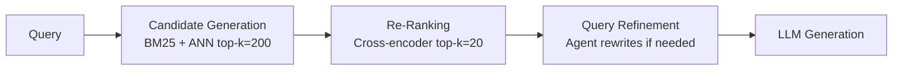
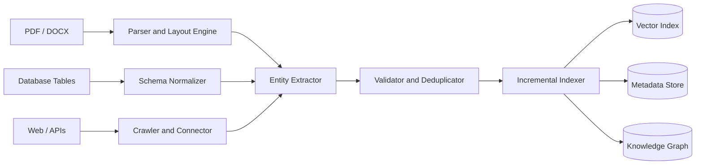
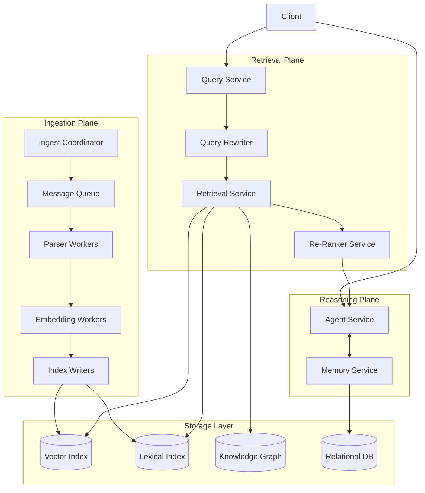

# Architectural Analysis of RAGFlow

## 1. Deep Document Understanding vs. Naive Chunking

Fixed-size chunking splits documents every N tokens regardless of structure. This breaks tables mid-row, separates figures from captions, and merges unrelated sections into the same chunk. The result is chunks that lose the meaning present in the original document.

RAGFlow's DeepDoc engine performs layout detection and structure extraction before chunking, identifying logical units like table cells, headers, and captions and splitting along those boundaries. When a user queries a specific financial figure, a layout-aware parser returns a self-contained chunk with full row and column context. A fixed-size chunker returns a row of numbers with no labels, making it nearly useless for retrieval.

Deep parsing also enables richer index schemas. Rather than storing raw text, the system indexes typed fields like header, value, and page number, which supports more precise hybrid search. The trade-off is preprocessing cost. Vision-based layout models are significantly more expensive than whitespace splitting, which is why RAGFlow exposes configurable parsers rather than enforcing deep parsing for every document type.

## 2. Chunking Strategy: Template vs. Semantic

Template-based chunking splits on structural markers like headings or known section labels. It is deterministic, fast, and requires no embeddings. For a financial report, it reliably isolates sections like income statements and risk factors based on document structure alone.

Embedding-driven semantic segmentation encodes sentences and splits when similarity between adjacent sentences drops below a threshold, signaling a topic shift. It adapts to content rather than formatting, making it useful for unstructured documents.

For highly structured documents, semantic chunking is the weaker choice. The similarity between "Revenue Recognition Policy" and "Revenue: $4.2B" is high since both discuss revenue, so the model may merge them into one chunk even though they serve different purposes. A template chunker correctly identifies the section boundary from structure.

For loosely structured corpora like chat logs, template chunking has no boundaries to work with and falls back to fixed-size splitting. A semantic segmenter can still detect topic shifts in conversational text. A well-designed system applies template chunking when the document schema is known and falls back to semantic segmentation otherwise, which is exactly the configurable approach RAGFlow exposes.

## 3. Hybrid Retrieval Architecture

BM25 ranks documents by weighted term overlap. Dense vector retrieval maps query and documents into a shared embedding space and measures cosine similarity. Their failure modes differ, which is why combining them improves overall retrieval.

BM25 fails on vocabulary mismatch. A query about a compound that blocks ACE2 receptors will miss documents using the phrase "SARS-CoV-2 entry inhibitor" because no tokens match. Dense retrieval fails on precision for exact terms. A query about a specific legal statute may return semantically related chunks that do not satisfy the exact reference. Dense models also struggle with rare entities like product codes that are underrepresented in pretraining data.

Because these failure modes are largely independent, combining both retrievers improves recall. A cross-encoder re-ranker scores the merged candidate set with full attention over both query and document, improving precision beyond what either retriever alone achieves. The edge case is correlated failure: when both retrievers return the same wrong document because it shares vocabulary and semantic similarity with the query, the re-ranker has no signal to demote it. Hybrid retrieval only helps when retriever failures are independent.

## 4. Multi-Stage Retrieval Pipeline

A single-pass ANN search uses a bi-encoder, which encodes the query and each document independently. Because the two are never compared directly, fine-grained relevance differences are invisible to the model. A multi-stage pipeline splits retrieval into candidate generation, which prioritizes recall using fast ANN search, and re-ranking, which applies a cross-encoder to only the small candidate set. This achieves cross-encoder precision without running it across the full index.

A larger candidate set improves recall but increases re-ranking latency linearly. The retrieval stage must be tuned so the relevant document is in the candidate set before re-ranking begins, because re-ranking can only reorder what it receives. If the relevant document is absent from the candidate set, the failure propagates silently into incorrect generation. This makes recall-at-k a critical metric to monitor in any production system.

## 5. Indexing Strategy and Storage Backends

An Elasticsearch-like hybrid store works best when workloads mix keyword search with structured filtering. Its inverted index handles BM25 and metadata filtering simultaneously, and it scales well through sharding. It is not optimized for high-dimensional vector search.

A vector-native database like Qdrant or RAGFlow's Infinity engine is optimized for semantic retrieval through HNSW indexing. It is the right choice when queries are natural language and metadata filtering is minimal. It cannot natively execute relational queries like joins or typed range filters.

A graph-augmented store is appropriate when queries require multi-hop reasoning over entity relationships. A question about which suppliers of one company are also customers of another cannot be answered by vector retrieval alone because no single chunk encodes that relationship. Graph traversal is required. Building the graph requires entity extraction and relation classification across the corpus, so this backend is only justified when relational reasoning is a core requirement of the application.

## 6. Query Understanding and Reformulation

The gap between how a user phrases a query and how the relevant document is written is a primary cause of retrieval failure. Query transformation reduces this gap. Query expansion adds synonyms or related terms before retrieval, recovering documents that use vocabulary the user did not. Query decomposition breaks a multi-part question into atomic sub-queries that are retrieved separately and combined. HyDE generates a hypothetical answer, embeds it, and uses that embedding as the retrieval vector, bridging the gap between short queries and longer document passages.

Static query-to-retrieval is a single forward pass. It is fast and works well when queries are clear and the corpus is dense. If retrieval misses, generation hallucinates or abstains with no recovery mechanism. Iterative agent-driven refinement uses the language model to evaluate whether retrieved context is sufficient and rewrites the query if not. This is more effective for ambiguous or multi-hop questions but adds latency per retrieval round. RAGFlow's multi-turn optimization implements a bounded version of this with configurable iteration limits to prevent runaway loops.

## 7. Knowledge Representation Layer

Dense vector representations embed documents into a high-dimensional space where semantic similarity maps to geometric proximity. Retrieval is fast and scalable. Compositional reasoning is implicit since the model encodes relationships during pretraining. Explainability is low because there is no interpretable reason why two vectors are close, which complicates debugging in enterprise settings.

A relational schema stores knowledge in typed tables with defined columns and foreign key relationships. Compositional reasoning is explicit through joins. Every result is traceable to specific rows and predicates, making explainability high. The limitation is rigidity: knowledge that does not fit a predefined column is dropped or stored as unstructured text. This works well when the domain is stable and well-understood.

A knowledge graph stores entities as nodes and relationships as typed directed edges. Compositional reasoning happens through graph traversal, enabling multi-hop queries that follow relationship chains across entities. Explainability is high because every answer corresponds to a traceable path through the graph. Construction cost is significant since building and maintaining the graph requires entity extraction and relation classification. RAGFlow's GraphRAG support reflects the recognition that this cost is justified when entity relationships are central to the application's query patterns.

## 8. Data Ingestion Pipeline Architecture

A robust ingestion system must handle data arriving in incompatible formats. A PDF has no schema, a relational database has a rigid one, and a REST API returns variable JSON. The normalizer produces a canonical document envelope containing an identifier, source, timestamp, content, and typed metadata fields regardless of input format. Explicit type coercion for fields like dates and currencies is necessary since these are common sources of subtle ingestion bugs.

Each document is hashed at ingestion time so on re-ingestion only changed documents are reprocessed. Vector indexes support efficient insertion but not efficient deletion. Removed documents must be tombstoned and compacted periodically, meaning they may briefly appear in retrieval results after deletion.

Synchronous indexing guarantees a document is queryable immediately but limits throughput to the speed of the slowest pipeline step, typically embedding. Asynchronous ingestion through a message queue allows batching of embedding calls on dedicated GPU workers, significantly increasing throughput at the cost of a propagation delay. The right choice depends on the application's SLA.

## 9. Memory Design in RAG Systems

Vector memory embeds conversation turns and stores them in a vector index. Relevant past context is retrieved and injected into the prompt on each new query. This scales to thousands of interactions without a predefined schema. The failure mode is semantic aliasing, where two distinct facts with similar embeddings interfere during retrieval and cannot be distinguished by the memory system.

Structured memory extracts facts from interactions and stores them as typed records with explicit fields. Retrieval is exact and auditable. The limitation is that the schema must be defined upfront, and facts outside it are dropped. This is a real constraint in open-ended conversations where unexpected information types frequently arise.

Episodic logs store every interaction verbatim and inject the full log into the context on each turn. This preserves all information without extraction overhead. The limitation is token cost since the log grows linearly with conversation length and eventually exceeds the context window. RAGFlow's evolution across v0.23 and v0.24 follows the pattern most production systems take: episodic logs for simplicity, vector memory for scale, and structured memory where factual precision is required. A mature system layers all three and selects which to query based on the query type.

## 10. End-to-End System Decomposition

The system decomposes into three planes: ingestion, retrieval, and reasoning, each backed by a shared storage layer.

The ingestion plane converts raw documents into indexed knowledge. The Ingest Coordinator places work onto a message queue, decoupling submission from processing. Parser Workers and Embedding Workers are stateless and scale horizontally based on queue depth. Parser Workers are CPU-bound and Embedding Workers are GPU-bound and benefit from request batching. Index Writers are stateful since they must be shard-aware when writing to the storage layer.

The retrieval plane is fully stateless. The Query Service receives the query, the Rewriter optionally reformulates it, the Retrieval Service fans out to all indexes in parallel, and the Re-Ranker scores the merged candidate set. All services in this plane scale freely behind a load balancer. The Re-Ranker carries a circuit breaker so that if latency exceeds the SLA threshold, the system returns unranked candidates rather than timing out.

The Agent Service holds session state for multi-turn interactions. This state can be pinned to a specific instance through session affinity or externalized to a distributed cache like Redis for failover. The Memory Service partitions by user ID to distribute load across the relational database.

The message queue between ingestion and retrieval enforces failure isolation. An ingestion backlog does not affect query latency, and a retrieval outage does not interrupt ingestion. The Re-Ranker circuit breaker ensures partial failures degrade quality gracefully rather than causing complete query failures across the system.
