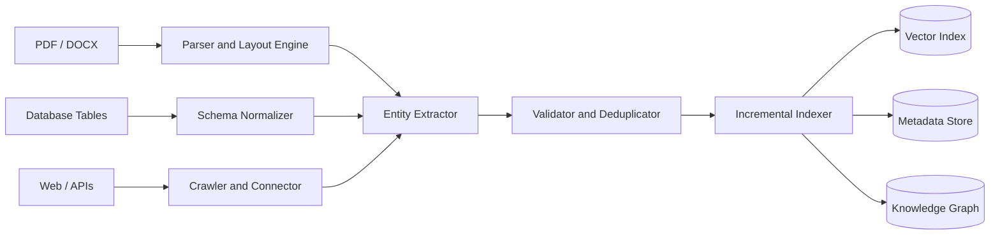
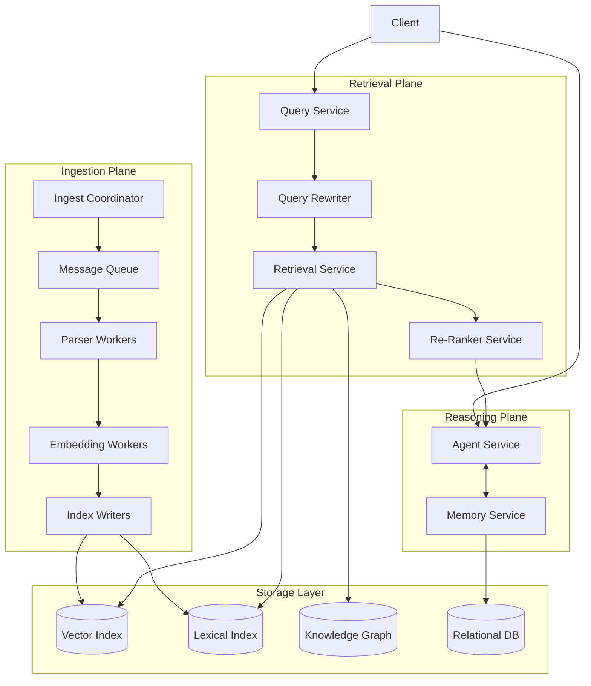

# Architectural Analysis of RAGFlow

## 1. Deep Document Understanding vs. Naive Chunking

To begin with, fixed-size chunking in enterprise RAG splits documents by every N tokens without taking into account the structure. This breaks tables at wrong places, separates diagrams from captions, and combines unrelated sections. As a result, it outputs chunks that lose the meaning the original document had. However, RAGFlow's DeepDoc outperforms because it does not come across any of those issues. The engine does layout detection and structure extraction before chunking the document. It identifies logical units and splits along the boundaries.

For example, if a user searches for a specific financial figure, the DeepDoc engine returns a chunk that includes the row and column context needed to understand the value, but a fixed-size chunker returns a row of numbers with no labels. This directly reduces retrieval fidelity. Deep parsing also allows for better index design because instead of storing raw text, the system indexes typed fields like header, value, and page number. However, the trade-off is preprocessing cost. Deep parsing is way more expensive than just splitting by whitespace. Therefore, RAGFlow lets users choose their parser instead of forcing deep parsing on every document.

## 2. Chunking Strategy: Template vs. Semantic

When it comes to chunking strategy, RAGFlow supports two main approaches: template-based chunking and embedding-driven semantic segmentation. Template-based chunking splits on structural markers like headings or known section labels. It is fast, deterministic, and does not require any embeddings. Embedding-driven semantic segmentation encodes sentences and splits when the similarity between adjacent sentences drops below a threshold, which signals a topic shift.

For highly structured documents like financial reports, semantic chunking is the weaker choice. For example, the similarity between "Revenue Recognition Policy" and "Revenue: $4.2B" is high since both discuss revenue, so the model may merge them into one chunk even though they serve completely different purposes. A template chunker correctly identifies that boundary from the document's own structure. On the other hand, for loosely structured corpora like chat logs, template chunking has no boundaries to work with and falls back to fixed-size splitting. A semantic segmenter can still detect topic shifts in that kind of text. Neither strategy works best for every case, which is why RAGFlow supports both and lets the user decide based on the document type.

## 3. Hybrid Retrieval Architecture

RAGFlow combines lexical retrieval using BM25, vector similarity search, and re-ranking. BM25 ranks documents by weighted term overlap between the query and the document. Dense vector retrieval maps both the query and documents into a shared embedding space and measures cosine similarity. The reason hybrid retrieval improves recall and precision is that these two methods fail in different ways.

BM25 fails on vocabulary mismatch. For example, a query about a compound that blocks ACE2 receptors will completely miss documents that use the phrase "SARS-CoV-2 entry inhibitor" because no tokens match. Vector-only retrieval fails on precision for exact terms. A query about a specific legal statute may return semantically related chunks that do not satisfy the exact reference needed. Because these failure modes are largely independent, combining both retrievers improves recall. A cross-encoder re-ranker then scores the merged candidate set with full attention over both the query and the document, which improves precision beyond what either retriever achieves alone. The edge case for hybrid retrieval is correlated failure. When both retrievers return the same wrong document because it shares both vocabulary and semantic similarity with the query, the re-ranker has no way to detect that. Hybrid retrieval only helps when the failures are independent.

## 4. Multi-Stage Retrieval Pipeline

RAGFlow decomposes retrieval into candidate generation, re-ranking, and query refinement rather than doing a single-pass ANN search. A single-pass ANN search uses a bi-encoder, which encodes the query and each document independently. Because the two are never directly compared, fine-grained relevance differences are invisible to the model. A multi-stage pipeline fixes this by splitting retrieval into two steps. Candidate generation prioritizes recall by retrieving a large set using fast ANN search. Re-ranking then applies a cross-encoder to only the small candidate set, scoring each query-document pair jointly. This achieves cross-encoder precision without running it across the full index, which would be too slow.

The recall versus latency trade-off sits between these two stages. A larger candidate set improves recall but increases re-ranking time linearly. The key issue with cascading error propagation is that if the relevant document is not in the candidate set at all, the re-ranker cannot recover it because it can only reorder what it already received. That failure then silently propagates into incorrect generation with no visible error signal. This makes recall-at-k a critical metric to monitor in any production RAG system.

## 5. Indexing Strategy and Storage Backends

RAGFlow supports switching between different storage backends including Elasticsearch and Infinity. The design criteria for selecting a backend depends on the type of workload it needs to serve.

An Elasticsearch-like hybrid store works best when the workload mixes keyword search with structured filtering. Its inverted index handles BM25 and metadata filtering simultaneously and scales well through sharding. However, it is not optimized for high-dimensional vector search. A vector-native database like RAGFlow's Infinity engine is built for semantic retrieval through HNSW indexing. It works best when queries are natural language and metadata filtering is not a priority. The downside is that it cannot run relational queries like joins or typed range filters. A graph-augmented store is the right choice when queries require multi-hop reasoning over entity relationships. For example, a question about which suppliers of one company are also customers of another cannot be answered by retrieving a single chunk. It requires traversing a graph of typed edges. Building that graph requires entity extraction and relation classification across the entire corpus, so this backend is only justified when relational reasoning is a core requirement.

## 6. Query Understanding and Reformulation

RAGFlow incorporates query rewriting and semantic gap handling through its multi-turn optimization feature. The reason query transformation is critical in RAG is that a raw user query is a short and often ambiguous expression of what the user actually needs. The gap between how the user phrases the query and how the relevant document is written is one of the main causes of retrieval failure.

Query expansion adds synonyms or related terms before retrieval, which helps recover documents that use vocabulary the user did not write. Query decomposition breaks a complex question into smaller sub-queries that are retrieved separately and then combined. HyDE goes further by generating a hypothetical answer, embedding it, and using that as the retrieval vector to bridge the gap between short queries and longer document passages. Static query-to-retrieval is just a single forward pass. It is fast and works fine when queries are clear, but if retrieval misses, the model hallucinates or abstains with no way to recover. Iterative agent-driven refinement uses the language model to check whether the retrieved context is enough and rewrites the query if it is not. This handles ambiguous and multi-hop questions much better but adds latency for each extra retrieval round. RAGFlow limits the number of iterations to prevent the loop from running indefinitely.

## 7. Knowledge Representation Layer

RAGFlow can construct embeddings, metadata layers, and knowledge graphs as different ways of representing knowledge. Each of these affects compositional reasoning and retrieval explainability differently.

Dense vector representations embed documents into a high-dimensional space where semantic similarity maps to proximity. Retrieval is fast and scales well. Compositional reasoning is implicit since the model encodes relationships during pretraining. However, explainability is low because there is no human-readable reason why two vectors are close, which makes it hard to debug wrong results. A relational schema stores knowledge in typed tables with defined columns and foreign key relationships. Compositional reasoning happens explicitly through joins. Every result is traceable to specific rows, which makes explainability high. The downside is that knowledge that does not fit a predefined column is either dropped or stored as plain text, losing its structure. A knowledge graph stores entities as nodes and relationships as typed directed edges. Compositional reasoning happens through graph traversal, which allows multi-hop queries to follow relationship chains. Explainability is high because every answer traces back through labeled edges. The cost is that building and maintaining the graph requires entity extraction and relation classification, which is a heavy pipeline to run continuously. RAGFlow's GraphRAG support shows that this cost is worth it when entity relationships are central to how users query the system.

## 8. Data Ingestion Pipeline Architecture

RAGFlow's ingestion pipeline converts heterogeneous data into indexed knowledge. A robust ingestion system needs to handle data that arrives in completely different formats. A PDF has no schema, a relational database has a rigid one, and a REST API returns variable JSON. The schema normalizer produces a standard document envelope with an identifier, source, timestamp, content, and typed metadata fields regardless of where the document came from. Explicit type coercion for fields like dates and currencies is important here because mismatches are a common source of bugs.

For incremental indexing, each document is hashed at ingestion time. On re-ingestion, only documents whose hash changed are reprocessed. Vector indexes support insertion well but not deletion. Removed documents have to be tombstoned and compacted periodically, meaning they can still briefly show up in retrieval results after being deleted. The consistency versus throughput trade-off comes down to how fast documents need to be queryable. Synchronous indexing makes a document queryable immediately but caps throughput at the speed of the slowest step, which is usually embedding. Asynchronous ingestion through a message queue batches embedding calls on dedicated GPU workers and improves throughput significantly, but documents may not be queryable for a short window after submission.

## 9. Memory Design in RAG Systems

RAGFlow introduces memory components for long-running interactions. There are three main memory architectures to compare: vector memory, structured memory, and episodic logs.

Vector memory embeds conversation turns and stores them in a vector index. On each new query, the most relevant past context is retrieved and added to the prompt. This scales well and does not need a predefined schema. The failure mode is semantic aliasing, where two facts with similar embeddings interfere during retrieval. For example, a stored user preference and an observed system property can be geometrically close in embedding space even though they refer to completely different things, and vector memory cannot tell them apart. Structured memory extracts facts into typed records with explicit fields. Retrieval is exact and auditable. The downside is that the schema must be defined upfront and facts that do not fit it are dropped, which is a real limitation in open-ended conversations. Episodic logs store every interaction verbatim and inject the full log into the context each turn. This preserves everything without needing extraction, but the token cost grows linearly and eventually hits the context window limit. RAGFlow's updates from v0.23 to v0.24 follow the same path most systems take: start with episodic logs, add vector memory for scale, and layer in structured memory where factual precision matters most.

## 10. End-to-End System Decomposition

RAGFlow spans ingestion, indexing, retrieval, reasoning, and serving. A microservices architecture for this system breaks into three planes: ingestion, retrieval, and reasoning, each backed by a shared storage layer.

The ingestion plane converts raw documents into indexed knowledge. The Ingest Coordinator places jobs onto a message queue, which decouples document submission from processing so a spike in uploads does not affect anything downstream. Parser Workers and Embedding Workers are stateless services that pull jobs from the queue and can be scaled horizontally. Parser Workers are CPU-bound and Embedding Workers are GPU-bound, so they scale differently. Index Writers are stateful because they need to know which shard owns which document when writing to storage.

The retrieval plane is fully stateless. The Query Rewriter reformulates the query if needed, the Retrieval Service fans out to all indexes in parallel, and the Re-Ranker scores the merged results. All of these services scale freely behind a load balancer. The Re-Ranker has a circuit breaker so that if latency exceeds the threshold, the system falls back to returning unranked candidates rather than timing out entirely.

The Agent Service in the reasoning plane is stateful because it holds session state for ongoing multi-turn interactions. That state can either be pinned to one instance through session affinity or stored in a distributed cache like Redis so any instance can handle it. The message queue between the ingestion and retrieval planes is the main failure isolation boundary. An ingestion backlog does not slow down queries, and a retrieval outage does not stop documents from being ingested.
