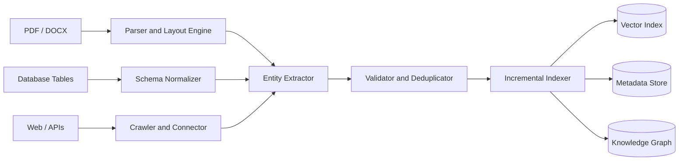
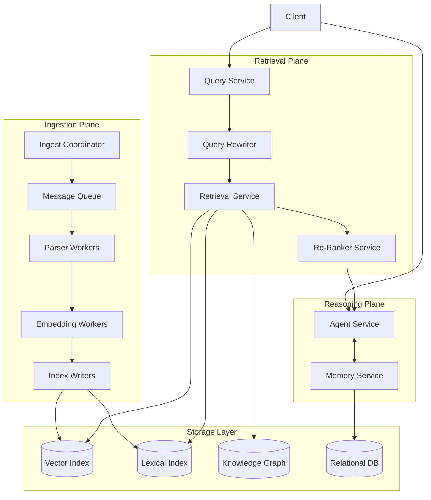

## 1. Deep Document Understanding vs. Naive Chunking

To begin with, fixed-size chunking in enterprise RAG splits documents by every N tokens without taking into account the structure. This breaks tables at wrong places, separates diagrams from captions, and combines unrelated sections. As a result, it outputs chunks that lose the meaning the original document had. However, RAGFlow's DeepDoc outperforms because it does not come across any of those issues. The engine does layout detection and structure extraction before chunking the document. It identifies logical units and splits along the boundaries.

For example, if a user searches for a specific financial figure, the DeepDoc engine returns a chunk that includes the row and column context needed to understand the value, but a fixed-size chunker returns a row of numbers with no labels. This directly reduces retrieval fidelity. Deep parsing also allows for better index design because instead of storing raw text, the system indexes typed fields like header, value, and page number. However, the trade-off is preprocessing cost. Deep parsing is way more expensive than just splitting by whitespace. Therefore, RAGFlow lets users choose their parser instead of forcing deep parsing on every document.

## 2. Chunking Strategy: Template vs. Semantic

RAGFlow supports two main approaches which are template-based chunking and embedding-driven semantic segmentation. Template-based chunking splits on structural markers like headings or known section labels. It is fast/deterministic, and does not require any embeddings. Embedding-driven semantic segmentation encodes sentences and splits when the similarity between sentences next to each other is below a threshold.  This signals a topic shift.

For highly structured documents like financial reports, semantic chunking is the worse choice. For example, a chat log section where a user asks about payment issues and another where they ask about account settings would be merged into one chunk because both relate to customer support, even though they cover completely different topics.  A template chunker correctly identifies that boundary from the document's own structure. On the other hand, for loosely structured documents like chat logs, template chunking has no boundaries to work with so it falls back to fixed-size chunking. A semantic segmenter can still detect topic shifts in that kind of text

## 3. Hybrid Retrieval Architecture

BM25 ranks documents by weighted term overlap between the query and the document. Dense vector retrieval maps both the query and documents into a shared embedding space and measures cosine similarity. The reason hybrid retrieval improves recall and precision is that these two methods fail in different ways.

BM25 fails on vocabulary mismatch. For example, a query searching for "car" will completely miss documents that use the word "automobile" because no tokens match. Vector-only retrieval fails on precision for exact terms. For example, a query searching for a specific invoice number may return chunks about similar invoices that do not match the exact number needed. Because these failure modes are largely independent, combining both retrievers improves recall. A cross-encoder re-ranker then scores the merged candidate set with full attention over both the query and the document, which improves precision beyond what either retriever achieves alone. The edge case for hybrid retrieval is correlated failure. When both retrievers return the same wrong document because it shares both vocabulary and semantic similarity with the query, the re-ranker has no way to detect that. Hybrid retrieval only helps when the failures are independent.

## 4. Multi-Stage Retrieval Pipeline

A single-pass ANN search uses a bi-encoder, which encodes the query and each document independently. Because the two are never directly compared, smaller relevance differences are not detected by the model. A multi-stage pipeline fixes this by splitting retrieval into two steps. Candidate generation prioritizes recall by retrieving a large set using fast ANN search. Re-ranking then applies a cross-encoder to only the small candidate set, scoring each query-document pair together. This results in cross-encoder precision without running it across the full index.  Doing that would be too slow.

The recall versus latency trade-off is mostly between two stages. A larger candidate set improves recall but increases re-ranking time linearly. The key issue with cascading error propagation is that if the relevant document is not in the candidate set at all, the re-ranker cannot recover it because it can only reorder what it already received. That failure then silently propagates into incorrect generation with no visible error signal. This makes recall-at-k a critical metric to monitor.

## 5. Indexing Strategy and Storage Backends

Choosing the right backend depends on what kind of queries the system needs to handle. An Elasticsearch-like hybrid store works best when the system needs to search by keywords and filter by fields like date or category at the same time. It scales well but is not built for vector search. A vector-native database like RAGFlow's Infinity engine is built for semantic retrieval and works best when queries are written in natural language. The downside is that it cannot handle relational queries. A graph-augmented store is the right choice when queries need to pull information from multiple connected sources. For example, a question about how many employees were in both the UK and USA offices cannot be answered by retrieving a single chunk because the answer requires connecting data across multiple records. Building that graph requires entity extraction and relation classification across the entire document, so this backend is only worth it when that kind of reasoning is a core requirement.

## 6. Query Understanding and Reformulation

Query transformation is important in RAG because users do not always phrase their query the same way the document is written, and that is the main reason retrieval fails.  Query expansion solves this by adding synonyms or related terms to the query before searching, which helps find documents that use different wording. Query decomposition breaks a complex question into smaller pieces that are each retrieved separately and then combined into one answer. HyDE takes a different approach by generating a fake answer to the query, embedding it, and using that as the search vector instead, which helps match short queries to longer documents. Static query-to-retrieval sends the query once and generates from whatever comes back. It is fast but has no way to recover if the first retrieval misses. Iterative agent-driven refinement checks whether the retrieved context actually answers the question and rewrites the query and searches again if it does not. This works better for unclear or complex questions but takes longer because of the extra retrieval rounds. RAGFlow caps the number of iterations so the loop does not run forever.

## 7. Knowledge Representation Layer

Dense vector representations store documents as numbers in a high-dimensional space where similar documents are placed close together. Retrieval is fast and scales well. The downside is that there is no clear reason why two documents are considered similar, which makes it hard to explain or debug wrong results. A relational schema stores knowledge in tables with defined columns and relationships between them. Every result can be traced back to a specific row, which makes it easy to explain. The downside is that any information that does not fit into a predefined column gets dropped or stored as plain text, losing its structure. A knowledge graph stores information as nodes connected by labeled edges. This makes it possible to answer questions that require jumping across multiple connections, like finding all employees who report to a manager who works under a specific director. Every answer can be traced back through the edges, so explainability is high. The cost is that building and keeping the graph up to date requires a lot of processing. RAGFlow's GraphRAG support shows this is worth it when relationships between entities are central to how users search.

## 8. Data Ingestion Pipeline Architecture

A good ingestion system has to handle data that comes in completely different formats.  The schema normalizer solves this by converting everything into a standard format with the same fields regardless of where it came from. Making sure fields are stored in the same format is important because mismatches cause bugs that are hard to track down.  For incremental indexing, each document is given a hash when it is first ingested. When the same document comes in again, the system checks if the hash changed and only reprocesses it if something is different. This avoids reprocessing the entire corpus every time. One issue is that vector indexes are good at adding new documents but not at removing them. Deleted documents have to be marked and cleaned up later, which means they can briefly still show up in search results after being removed. The consistency versus throughput trade-off is about how quickly documents need to be searchable. Processing documents immediately means they are searchable right away but slows down how many can be handled at once. Using a message queue to batch and process documents in the background handles much more volume but means there is a short delay before a new document can be found in search.

## 9. Memory Design in RAG Systems

Vector memory saves each conversation turn as an embedding and stores it in a vector index. When a new query comes in, the most relevant past context is pulled out and added to the prompt. This works well at scale and does not need any predefined structure. The problem is that two different facts that sound similar can get mixed up during retrieval. For example, "the user likes dark mode" and "the dashboard has a dark background" are similar in meaning but refer to completely different things, and vector memory cannot tell them apart. Structured memory saves facts as typed fields like name, value, and source. Results are exact and easy to trace. The downside is that the fields have to be decided upfront, and anything that does not fit gets thrown away, which is a problem in open-ended conversations where all kinds of information comes up. Episodic logs just save every message as-is and feed the whole history into the prompt each turn. Nothing gets lost, but the more the conversation grows the more tokens it takes up, and eventually it hits the context window limit. RAGFlow's updates from v0.23 to v0.24 follow the same path most systems take: start with episodic logs, add vector memory for scale, and bring in structured memory where accuracy on specific facts matters most.

## 10. End-to-End System Decomposition

The ingestion plane is responsible for converting raw documents into indexed knowledge. The Ingest Coordinator puts jobs onto a message queue so that document uploads and processing happen separately. This means a sudden spike in uploads does not slow down the rest of the system. Parser Workers and Embedding Workers are stateless, meaning any instance can handle any job, so they can be scaled up easily by adding more. Parser Workers use CPU and Embedding Workers use GPU, so they need to be scaled differently. Index Writers are stateful because they need to know exactly where in storage each document belongs.  The retrieval plane is fully stateless, meaning every service in it can be replicated freely. The Query Rewriter changes the query if needed, the Retrieval Service searches all indexes at the same time, and the Re-Ranker scores and ranks the results. If the Re-Ranker gets too slow, a circuit breaker kicks in and the system returns unranked results instead of making the user wait or getting no response at all.  The Agent Service in the reasoning plane is stateful because it keeps track of what happened in the conversation so far. That session data can either stay on one instance or be stored so any instance can pick it up if needed. The message queue between the ingestion and retrieval planes keeps the two sides independent. If ingestion gets backed up it does not affect search, and if search goes down documents can still be ingested.
